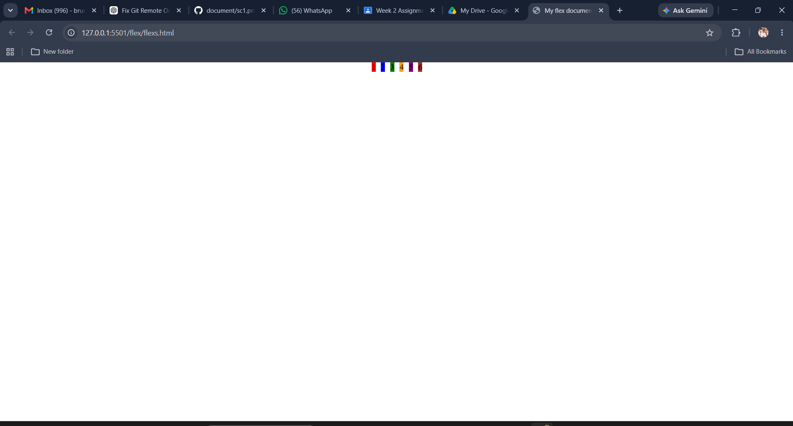
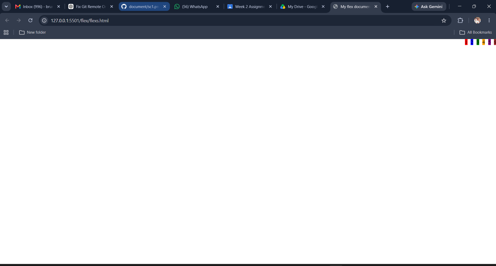
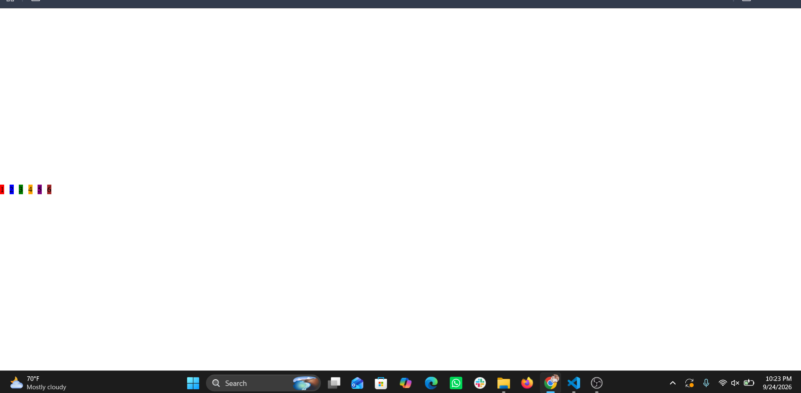
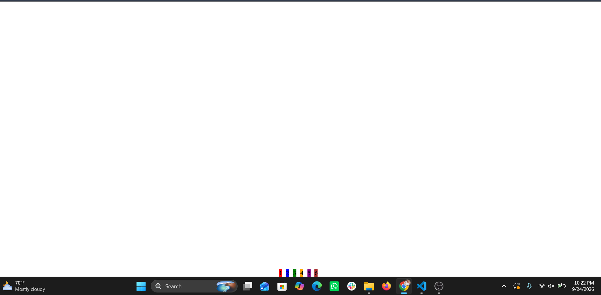
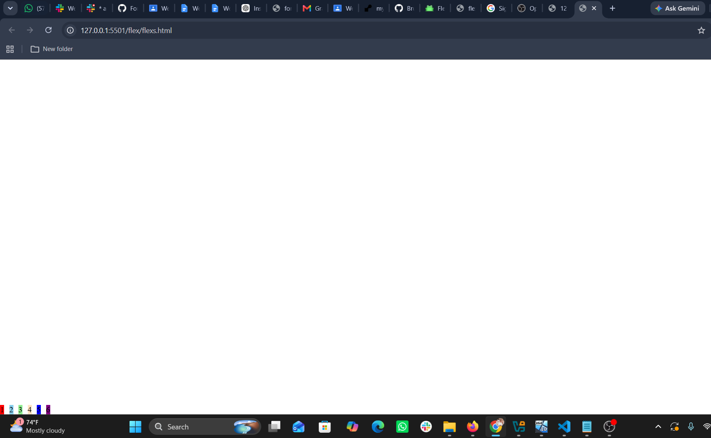
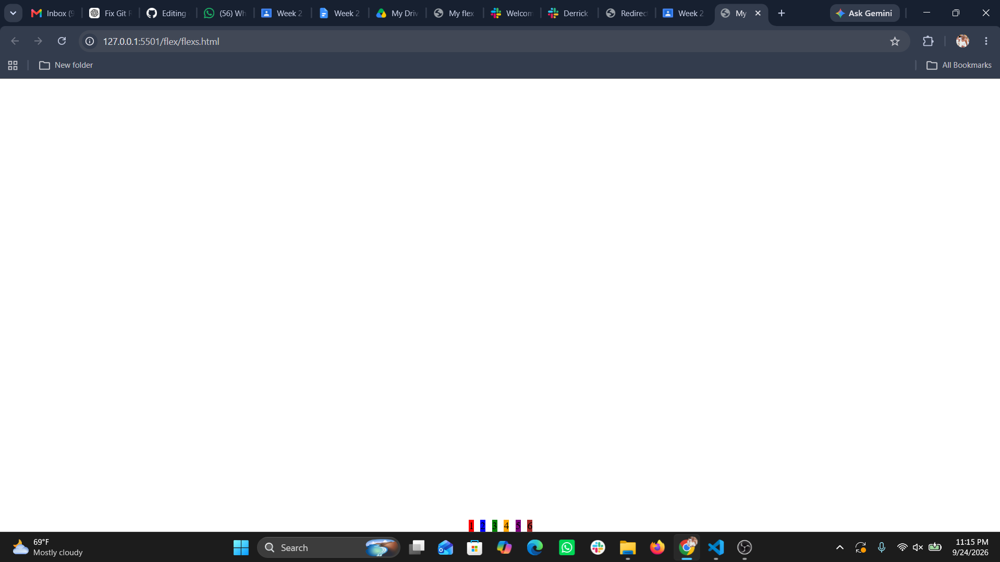

my video
https://drive.google.com/file/d/1fNKx1btZS9Sa5DpiACRrrgtfznCCkQOq/view?usp=drive_link

Project Description

This project demonstrates how CSS Flexbox can be used to position boxes in all 9 areas of the screen.

The project uses HTML and CSS only. No JavaScript is used.

The flex container fills the entire screen using:

height: 100vh;

The project contains at least six colored boxes, each with a number. CSS animation is used to move the boxes through different positions.
Technologies Used
HTML5
CSS3
CSS Flexbox
CSS @keyframes Animation
Project Files

Flexbox Properties Used
1. display: flex

Creates a Flexbox container.

.container {
    display: flex;
}

2. justify-content

Controls the alignment of flex items along the main axis.

Examples:

justify-content: flex-start;
justify-content: center;
justify-content: flex-end;

flex-start → beginning of the main axis
center → center
flex-end → end of the main axis
3. align-items

Controls the alignment of items along the cross axis.

Examples:

align-items: flex-start;
align-items: center;
align-items: flex-end;

4. align-content

Controls the alignment of multiple flex lines when wrapping is enabled.

align-content: flex-start;
align-content: center;
align-content: flex-end;

5. flex-direction

Defines the direction of the flex items.

flex-direction: row;

or

flex-direction: column;

6. flex-wrap

Allows flex items to move onto multiple lines.

flex-wrap: wrap;

7. gap

Creates space between the flex items.

gap: 20px;

The 9 Positions
Positionjustify-contentalign-items
Top Left	flex-start	flex-start
Top Center	center	flex-start
Top Right	flex-end	flex-start
Middle Left	flex-start	center
Center	center	center
Middle Right	flex-end	center
Bottom Left	flex-start	flex-end
Bottom Center	center	flex-end
Bottom Right	flex-end	flex-end
CSS Animation

The project uses @keyframes to change the Flexbox alignment properties and move the boxes through different positions.

The animation repeats continuously using:

animation-iteration-count: infinite;

No JavaScript is used.

Screenshots
Top Left

Top Center

Top Right

Middle Left

Center

Middle Right

Bottom Left

Bottom Center

Bottom Right

